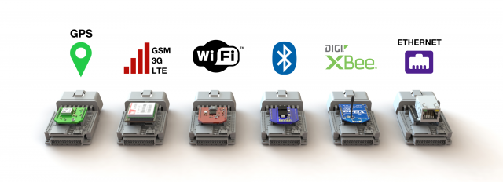
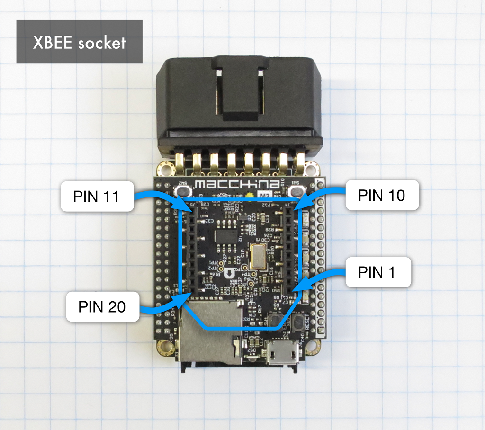

# Communication

## XBee-compatible socket

M2 has an _XBee-compatible form factor socket_ on the top of the processor board. In other words: two 2mm pitch x 10 pin headers spaced 22mm apart. You an read more about [XBee modules on Wikipedia](https://en.wikipedia.org/wiki/XBee)



There are LOTs of modules that fit this socket, with many different functions. WiFi, BLE, GSM, LTE, Ethernet, etc.

When connecting a _XBee-compatible form factor socket_ to M2, makes sure that is is oriented so that pin 1 \(+3.3V\) is at the corner nearest the USB socket as shown here:



For an image showing the pin names of the XBee socket on M2, click [here.](../processor/pin-mapping.md#xbee)

## USB

M2 has a USB connector that can act as either a HOST or DEVICE depending on your code.

M2 uses Native USB port only. To print something to the Serial monitor, you'd need to use this command:

```cpp
SerialUSB.print("Something");
```

