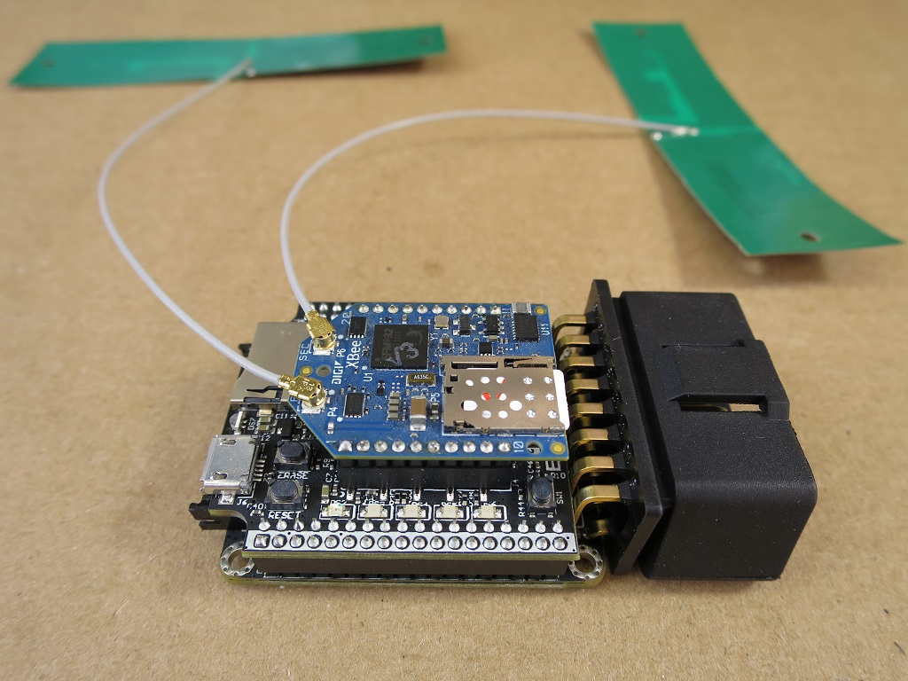

# Cellular

This tutorial will show how to connect your car to the internet using M2, a [Digi XBee Cellular LTE modem](https://www.digi.com/products/xbee-rf-solutions/embedded-cellular-modems/digi-xbee-cellular) and a SIM card. You may also wish to reference the [modem's datasheet](https://www.digi.com/pdf/ds_xbee-cellular.pdf).

## Setup

The modem plugs directly into the 20 pin wireless socket on top of your M2. Make sure that it is oriented correctly with the angled chamfers pointed toward the USB/SD side of your M2. Please make sure your M2 is not being powered when plugging in the modem.

Before plugging the modem into your M2, make sure to install a SIM card. This modem uses a 4FF \(Nano\) size SIM card.



## Power

As you work with the Digi modem, please keep in mind that it requires more power that your computer can provide directly over a USB port. You have 2 options:

* Power your M2 via the OBD2 port \(i.e. plugging into your car or some sort of adapter\)
* Use a powered USB hub. This option is preferable for desktop development. We've had good luck with this inexpensive hub:

[https://www.amazon.com/AmazonBasics-Port-2-5A-power-adapter/dp/B00DQFGH80](https://www.amazon.com/AmazonBasics-Port-2-5A-power-adapter/dp/B00DQFGH80)

## Basic communication

A good first step is to check that everything is working it to talk to the modem from your computer, through your M2. For this, you need to program your M2 with a simple sketch that will forward data between the 2 serial ports:

* **USBSerial**, the USB connection between the M2 processor and your computer.
* **Serial**, the Serial connection between the M2 processor and the XBee socket pins

This sketch will also make the GREEN LED blink as the [associate](https://www.digi.com/resources/documentation/digidocs/90001525/default.htm#reference/r_cell_associate_led.htm%3FTocPath%3DHardware|_____4) pin of the modem toggles. The pin signals and locations for the modem can be found [here](https://www.digi.com/resources/documentation/digidocs/90001525/default.htm#reference/r_pinouts_th.htm%3FTocPath%3DHardware|Pin%20signals|_____0).

```cpp
int AssociateState = 0;            // variable for reading the associate status

void setup() {
  Serial.begin(9600);              // Serial port for XBEE socket
  SerialUSB.begin(9600);           // Native USB port
  pinMode(XBEE_MULT2, INPUT);      // DIGI Associate PIN
  pinMode(DS6, OUTPUT);            // Green LED
  pinMode(XBEE_RST, OUTPUT);
  digitalWrite(XBEE_RST, HIGH);    // Make sure RESET is HIGH
  pinMode(DS2, OUTPUT);
  digitalWrite(DS2, LOW);          // Turns on Red LED
}

void loop() {

  if (SerialUSB.available()) {     // read from port 1, send to port 0:
    int inByte = SerialUSB.read();
    Serial.write(inByte);
  }

  if (Serial.available()) {        // read from port 0, send to port 1:
    int inByte = Serial.read();
    SerialUSB.write(inByte);
  }

  AssociateState = digitalRead(XBEE_MULT2);

  if (AssociateState == HIGH) {
    digitalWrite(DS6, HIGH);       // turn LED on:
  } else {
    digitalWrite(DS6, LOW);        // turn LED off:
  }
}
```

The second part to a basic communication test is the software on your computer. Digi offers a nice UI called XCTU to communicate with their products. Download the [latest verison](https://www.digi.com/products/xbee-rf-solutions/xctu-software/xctu).

Once downloaded and installed, launch XCTU and follow the instructions from [Digi's documentation](https://www.digi.com/resources/documentation/digidocs/90001525/default.htm#tasks/t_add_device.htm%3FTocPath%3DGetting%20started%20with%20the%20XBee%20Cellular%20Modem%20Development%20Kit|Configure%20the%20device%20using%20XCTU|_____1).

From there, you can do all sorts of fun things, from sending an SMS to connecting to servers to posting data to a website. Several examples are found on [Digi's documentation page](https://www.digi.com/resources/documentation/digidocs/90001525/default.htm).

