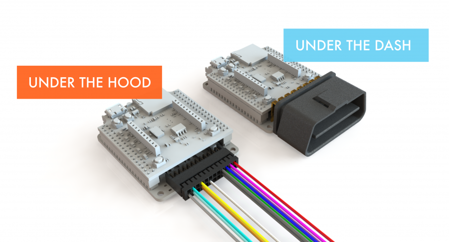
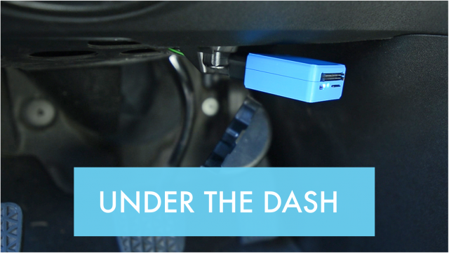
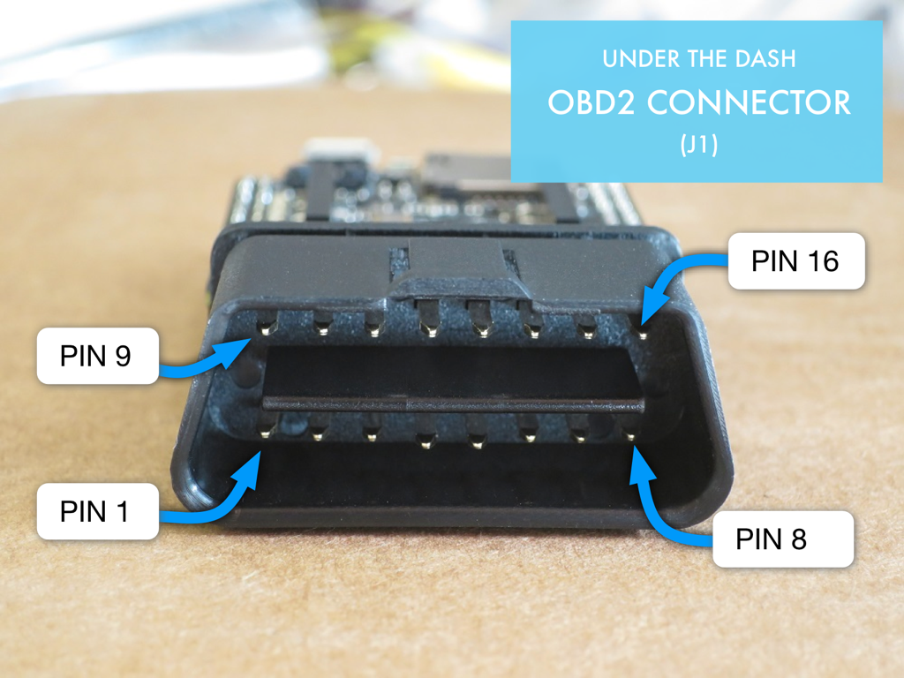
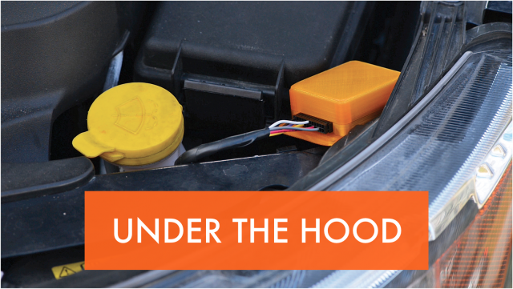
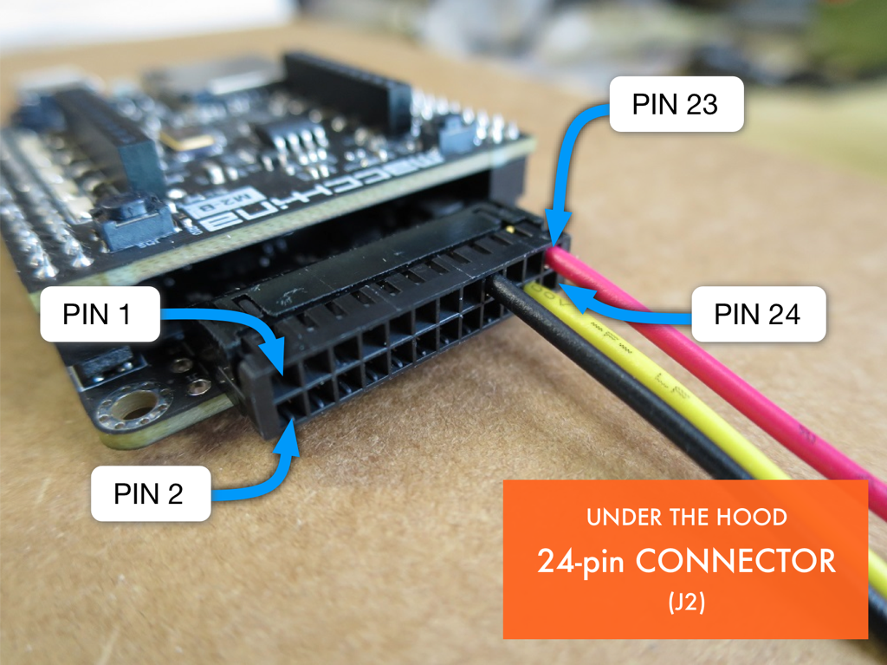

# Installation

The Macchina M2 was designed to be modular to give you the option of many installation options. The under-the-dash \(UTD\) version plugs directly into the OBD2 port of any modern car. The under-the-hood \(UTH\) version can be spliced into a wire harness. A connector is the only difference between the 2 versions.

## Under-the-Dash \(UTD\)

The "Under-the-Dash" version of the M2 plugs directly into the OBD2 port of the modern car. Any car built after 1996 has an OBD2 port near the steering wheel, under the dash.

The OBD2 connector is a 16 pin connector that provides power and a data connection. The image below shows the pin orientation of this 16 pin connector.

This following table describes the functionality of each pin.

| Pin | Schematic name | function |
| :--- | :--- | :--- |
| 1 | SWC\_BUS | Single Wire CAN |
| 2 | J1850+\_BUS | J1850 + BUS |
| 3 | MSC\_BUS+ | CAN1 HIGH |
| 4 | CHASSIS | CHASSIS GND |
| 5 | DGND | Digital GND |
| 6 | HSC\_BUS+ | CAN0 HIGH |
| 7 | 9141\_K\_BUS | K-LINE or LIN channel 1 |
| 8 | TP2\_NET | Test Point |
| 9 | TP1\_NET | Test Point |
| 10 | J1850-\_BUS | J1850 - BUS |
| 11 | MSC\_BUS- | CAN1 LOW |
| 12 | TP3\_NET | Test Point |
| 13 | TP4\_NET | Test Point |
| 14 | HSC\_BUS- | CAN0 LOW |
| 15 | 9141\_L\_BUS | L-LINE or LIN channel 2 |
| 16 | VIN | +12V INPUT |

## Under-the-Hood \(UTH\)

The "Under-the-Hood" version of the M2 is exactly the same as the "Under-the-Dash" version, but rather than a OBD2 connector, it uses a more general purpose connector. This connector takes the form of a 24-pin pluggable connector. Typical usage for this connector would be a more permanent installation where M2 would be hard-wired or spliced into an existing cable harness.

The image below shows the pin orientation of the 24 pin connector. Notice that the top row has the ODD pins and the bottom row has the EVEN pins.

This following table describes the functionality of each pin.

| Pin | Schematic name | function |
| :--- | :--- | :--- |
| 1 | TP1\_NET | Test Point |
| 2 | SWC\_BUS | Single Wire CAN |
| 3 | J1850-\_BUS | J1850 - BUS |
| 4 | J1850+\_BUS | J1850 + BUS |
| 5 | DGND | Digital GND |
| 6 | DGND | Digital GND |
| 7 | MSC\_BUS- | CAN1 LOW |
| 8 | MSC\_BUS+ | CAN1 HIGH |
| 9 | DGND | Digital GND |
| 10 | DGND | Digital GND |
| 11 | TP3\_NET | Test Point |
| 12 | CHASSIS | CHASSIS GND |
| 13 | TP4\_NET | Test Point |
| 14 | DGND | Digital GND |
| 15 | DGND | Digital GND |
| 16 | DGND | Digital GND |
| 17 | DGND | Digital GND |
| 18 | DGND | Digital GND |
| 19 | HSC\_BUS- | CAN0 LOW |
| 20 | HSC\_BUS+ | CAN0 HIGH |
| 21 | 9141\_L\_BUS | L-LINE or LIN channel 2 |
| 22 | 9141\_K\_BUS | K-LINE or LIN channel 1 |
| 23 | VIN | +12V INPUT |
| 24 | TP2\_NET | Test Point |

