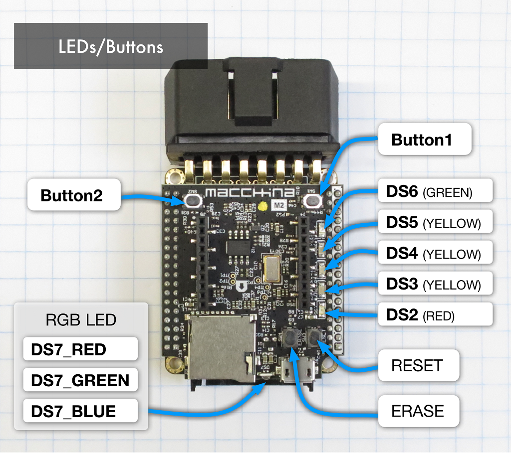
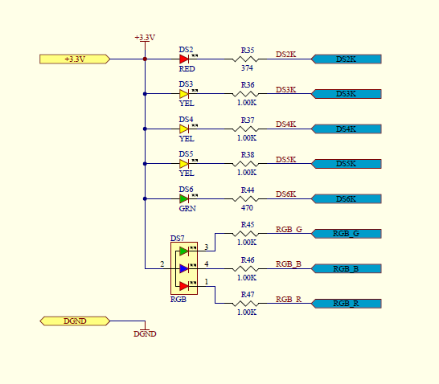

# LEDS/Buttons

There are several LEDs and Buttons on the processor board of the Macchina M2. These are user programmable and can be used for many applications.



## LEDs

M2 has 5 single-color LEDs and 1 RGB LED. Each LED is active LOW - the processor needs to pull the pin LOW to turn on the LED.



The following table shows what LEDs correspond to what Pin name.

| LED | Mapped Pin Name |
| :--- | :--- |
| DS2 \(RED\) | DS2 |
| DS3 \(YELLOW\) | DS3 |
| DS4 \(YELLOW\) | DS4 |
| DS5 \(YELLOW\) | DS5 |
| DS6 \(GREEN\) | DS6 |
| RGB RED | DS7\_RED / RGB\_RED |
| RGB GREEN | DS7\_GREEN / RGB\_GREEN |
| RGB BLUE | DS7\_BLUE / RGB\_BLUE |

For example, if you want the Green LED to blink, this sketch will do that for you:

```cpp
void setup() {
  // initialize digital pin DS6 as an output.
  pinMode(DS6, OUTPUT);
}

// the loop function runs over and over again forever
void loop() {
  digitalWrite(DS6, LOW);   // turn the LED on (LOW is the voltage level)
  delay(1000);              // wait for a second
  digitalWrite(DS6, HIGH);  // turn the LED off by making the voltage HIGH
  delay(1000);              // wait for a second
}
```

## Buttons

M2 has 4 buttons on the Processor board.

2 of these buttons \(**Button1** and **Button2**\) are user-programmable. Use these for triggering something in your program. For example, this code turns on the Red LED when Button 1 is pressed:

```cpp
const int buttonPin = Button1;     // the number of the pushbutton pin
const int ledPin =  DS2;      // the number of the LED pin

int buttonState = 0;         // variable for reading the pushbutton status

void setup() {
  pinMode(ledPin, OUTPUT);
  pinMode(buttonPin, INPUT);
}

void loop() {
  buttonState = digitalRead(buttonPin);

  if (buttonState == LOW) {   // If button is pressed
    digitalWrite(ledPin, LOW);  // Turn the Red LED on
  } else {
    digitalWrite(ledPin, HIGH);  // Turn the Red LED off
  }
}
```

**RESET** button will reset the processor.

**ERASE** button is used in conjunction with the RESET button. In the event your program hangs or there is some other issue, power up M2, hold down ERASE and then press and release RESET. This will erase the flash on the processor.

