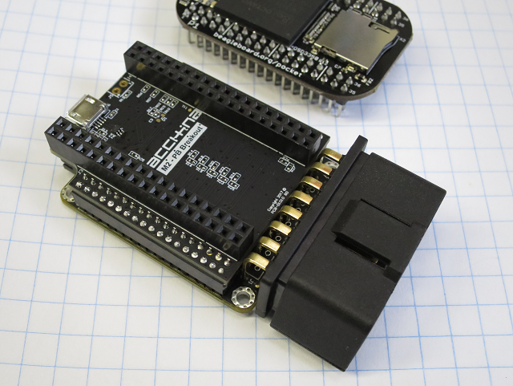
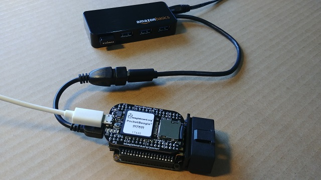
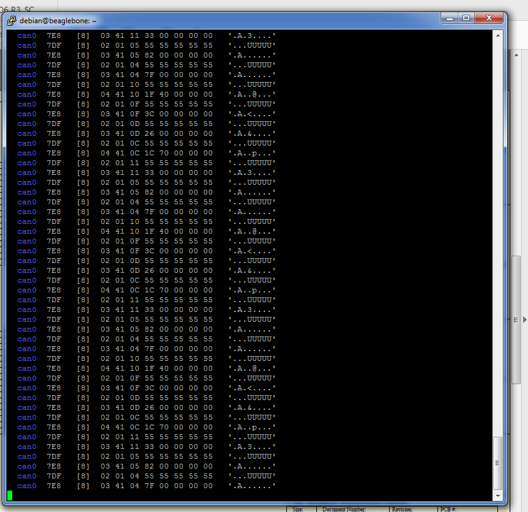

# Getting Started

This project shows how to interface the PocketBeagle to your car's OBD port through the Macchina M2 interface and an adapter board.

Note: this project is early in development. This page contains documentation for basic setup of PocketBeagle + M2 Interface board + Adapter board\)



## Parts:

* [PocketBeagle](https://beagleboard.org/pocket)
* [M2 Interface board](https://www.macchina.cc/content/interface-board-utd)
* PocketBeagle/M2 Adapter board \(limited availability - contact us if interested in this project\)

The following parts are common and can be found from many sources/manufacturers. Links shown are the parts we used for this project.

* [4GB SD card](https://www.amazon.com/dp/B001FXZTIY/ref=psdc_3015433011_t4_B00MHZ6UDC)
* [Powered USB hub](https://www.amazon.com/gp/product/B00DQFGH80/ref=oh_aui_detailpage_o00_s00?ie=UTF8&psc=1) \(no longer necessary if using just WiFi dongle\)
* [WIFI dongle](https://www.amazon.com/Edimax-EW-7811Un-150Mbps-Raspberry-Supports/dp/B003MTTJOY/ref=sr_1_1?ie=UTF8&qid=1513258750&sr=8-1&keywords=Edimax+Network+EW-7811UN)
* [OTG adapter](https://www.amazon.com/UGREEN-Adapter-Samsung-Controller-Smartphone/dp/B00LN3LQKQ/ref=sr_1_5?s=electronics&ie=UTF8&qid=1513361808&sr=1-5&keywords=usb+otg+adapter)

## Adapter board:

The adapter board plugs directly into the M2 Interface board and provides: 1. Routing of power and signals from M2 Interface board to PocketBeagle. 2. Battery connector for standard 2Pin JST battery connector and single cell lithium battery. 3. USB host port \(with ESD protection\). 4. Voltage scaling for 6 Analog inputs. 5. Several 0 ohm jumpers to route signals as needed.

PCB files are found at these links:

* [Schematic](https://github.com/macchina/pocketbeagle-adapter-hardware/blob/master/SCH-01010%20R0%20SCHEM_RELEASE.PDF)
* [Part location file](https://github.com/macchina/pocketbeagle-adapter-hardware/blob/master/PCB-01010%20R0%20STUFFCHARTS.PDF)
* [Pin number file](https://github.com/macchina/pocketbeagle-adapter-hardware/blob/master/PCB-01010%20R0%20PIN%20NUMBER%20CHART.PDF)

## PocketBeagle Setup:

### Step 1: Hook stuff up.

Plug the adapter PCB into the M2 interface board and plug the PocketBeagle into the adapter board. If you have a new PocketBeagle, you'll need to solder some headers onto it. Since the PocketBeagle is not keyed, be sure to plug it in so that the USB ports are on the same side.


The wireless adapter can be plugged directly into the board, no powered USB hub required.




### Step 2: Create a bootable SD card

Follow instructions [here](https://beagleboard.org/getting-started) to create a bootable SD card. Once you have a bootable SD card, plug it into the PocketBeagle.

Plug a microUSB cable into the PocketBeagle and your computer. After a minute or so, use your favorite terminal to ssh to 192.168.7.2

Login: _debian_ Password: _temppwd_

### Step 2.5: Change your password \(optional but recommended\)

We want to make sure that others wont be able to access your device to do this the main thing we are going to do is change the root password.

```text
sudo passwd root
```

### Step 3: Connect to internet.

First thing we'll want to do is connect to the internet to be able to download the latest packages. To do that, we'll use WIFI. Type the commands as shown below

```text
sudo connmanctl
connmanctl> enable wifi
Enabled wifi
connmanctl> scan wifi
Scan completed for wifi
connmanctl> services
```

All of the hotspots that your setup can see will be listed here, and look something like this:

wifi\_xxxxxx\_xxxxxx\_managed\_psk

Run these commands to connect:

```text
connmanctl> agent on

connmanctl> connect wifi_xxxxxx_xxxxxx_managed_psk

Passphrase? xxxxxxxxxxx

connected wifi_xxxxxx_xxxxxx_managed_psk

connmanctl> quit
```

You should now be connected to your local wifi. You can check that you have an IP address by typing the following in the terminal window:

```text
ifconfig
```

You should now see an IP address under wlan0 and you can now connect to this IP address in the future to program your PocketBeagle.

### Step 4: Set up pins

Next we make sure the pins on the PocketBeagle are set up correctly as shown at this link:

[https://github.com/beagleboard/pocketbeagle/wiki/Peripherals\#can](https://github.com/beagleboard/pocketbeagle/wiki/Peripherals#can)

Type this into terminal:

```text
config-pin P1_28 can
config-pin P1_26 can
```

### Step 5: print out CAN messages

Next, we set up the CAN interface and turn it on. Note that we are setting rate at 500Kb/s here. Your car might be a different BAUD rate.

```text
sudo ip link set can0 type can bitrate 500000 listen-only on

sudo ifconfig can0 up
```

To see actual data, we need to do 2 things: 1. Plug M2/PocketBeagle into your car or an emulator \(No need for hub, and WIFI dongle anymore - those can be unplugged\) and 2. enter this command to print output to terminal screen:

```text
candump -cae can0,0:0,#FFFFFFFF
```

If everything is set up correctly, you should see something like this:



While this looks pretty cool, it is hard to see what is going on. Press CTRL+C to end output to terminal.

Logging CAN data to a file makes it easier to analyze the data. To do that, use this command to log data to current working directory:

```text
candump -l any,0:0,#FFFFFFFF
```

### Step 6: Going further.

Next steps for this program is setting up and using more sophisticated analysis tools.

