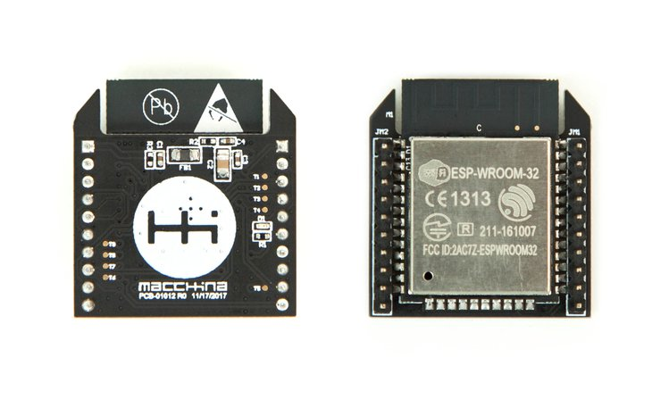

# About SuperB

SuperB marries two of hardware’s ubiquitous names - the “Bee” form factor and ESP32. The Bee form factor was derived from DIGI’s XBee industrial grade IoT boards. This form factor has long been used to add wireless connectivity to hardware across the board. But in the maturing market of connected items, two protocols stand as required: Wi-Fi and Bluetooth. ESP32 brings both, and in an easy-to-use package - giving maximum flexibility to your existing hardware and for your next generation of modular, extensible products.

## Features and Specifications

* Open source hardware
* XBee form-factor compatible \(3.3 V levels, UART, SPI and GPIOs broken out to headers\)
* Based on popular ESP32 SoC
* Wi-Fi \(802.11 b/g/n\)
* Bluetooth \(Classic and BLE\)
* Programmable with many tools, including Arduino IDE
* OTA \(Over-the-Air\) flashing capable
* Dual Core processor up to 240 MHz
* Integrated 4 MB flash - we may upgrade this to 16 MB
* Sleep current is less than 5 μA
* Fully certified with integrated antenna and software stacks
* One programmable LED

## What can SuperB do for you?

We designed SuperB as a wireless solution that plugs into the Bee socket of [M2](https://www.macchina.cc/m2-introduction), our automotive interface hardware. Fortunately for you and us, Bee sockets are found everywhere, with over ten million Bee modules deployed to date. Wherever the modular Bee socket is found, SuperB will work. Some examples? [SparkFun’s Wireless Joystick Kit](https://www.sparkfun.com/products/14051) and [Adafruit’s Tweet-a-watt](https://learn.adafruit.com/tweet-a-watt) are two great examples of cool Bee-ready hardware and projects available today.

SuperB will come preloaded with [AT Command code](https://github.com/espressif/esp32-at), allowing you to communicate with ESP32 over UART with any microcontroller using standard AT commands. Want to use it like an Arduino? Program SuperB using the [Arduino IDE](https://github.com/espressif/arduino-esp32) for whatever you are looking to build. You can even program SuperB to act as a wireless bootloader for a host system. Better yet, you can reprogram SuperB to wirelessly connect SavvyCan, creating a wireless car hacking dynamic duo with M2! Check back for instructions and code in a future update!

## External Antenna Availability

**Built-in 'trace' antenna:** This is the original SuperB design. It uses the ESP32-WROOM-32D module, and the antenna is built into the device.

**U.FL for external antenna:** This option uses the ESP32-WROOM-32U module, and allows you to connect your external antenna via U.FL connector. This option works well when you plan to enclose your SuperB in a metal box, tin foil hat or other material that interferes with antenna reception. Please note that backers need to provide their own antenna solution for this option.

